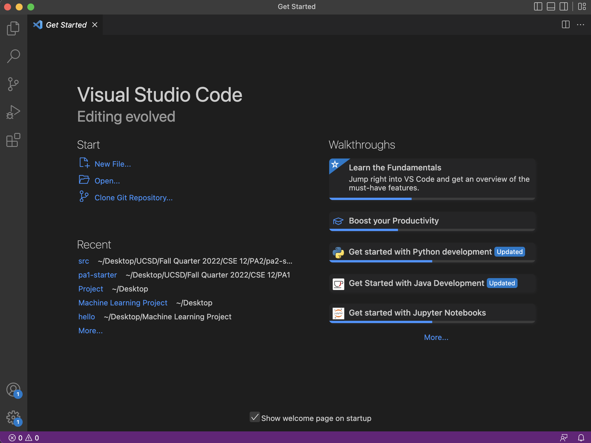
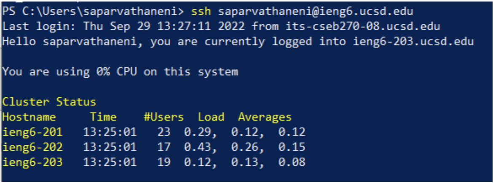
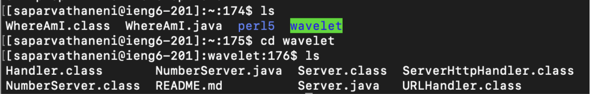
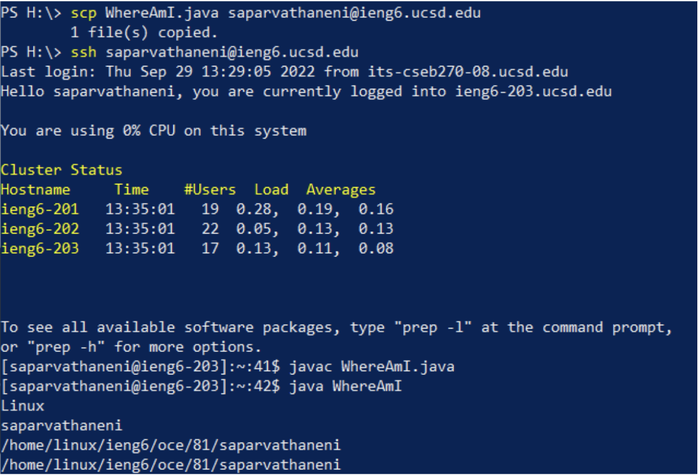
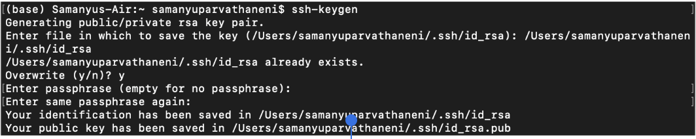
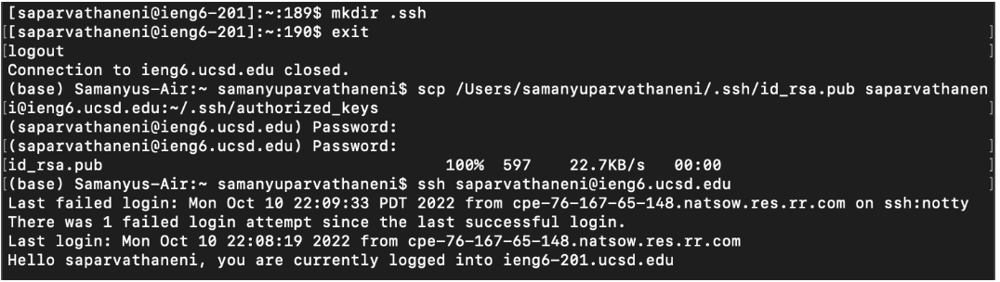
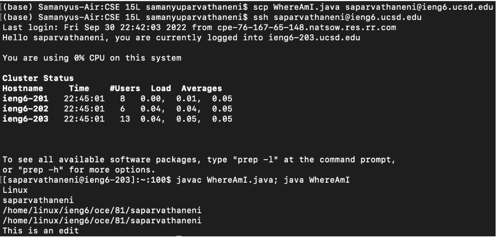

# Week 1 Lab Report
## Samanyu Parvathaneni
**1. Installing Visual Studio Code**

Navigate to the VS Code website [link](https://code.visualstudio.com/). Here, you will download the version of the software that is appropriate for your machine. VS Code, also known as Visual Studio Code, is a source code editor, used to edit and run programs. I completed this lab on a Windows machine, so I downloaded the Windows version. A macOS version is available on the same website, if you are using a Mac. After downloading the program, you must complete the setup process and customize the application however you desire. Now, you are ready to Open VS code.

**2. Remotely Connecting**

After downloading OpenSSH from the web, you can use either Command Prompt or Powershell to remotely connect to the server. Type the command ssh, followed by your username. You will then be prompted to enter your password. After you enter that, you will be connected to the remote server.

**3. Trying Some Commmands**

Now that you are connected to the remote server, you can use commands to retrieve files or navigate the directories. The command `ls` is used to list the contents of the current directory. After that, you can use `cd` to change the directory. Type `cd` followed by the directory you want to access.

**4. Moving Files with `scp`**

In order to copy files from your local computer to the remote server, you must use a command called `scp`. While on your local computer, type `scp` followed by the file you wish to copy, followed by the location you would like to copy it to. After using `scp` to copy the file, I then compiled and ran the file using javac and java to see if it ran as expected.

**5. Setting an SSH Key**

Since entering your password every time you login to the remote server can get time-consuming, you can generate a ssh key to streamline the process of logging into the remote server. Enter the command `ssh-keygen` to start the process. You will have to enter the file path of the file in which you want to save the key. Then you will log back into the remote server and create a directory called “.ssh”. Then, exit the remote server and use `scp` on the local machine to copy the public key to the remote server. Now, you should be able to login to the remote server without entering your password.

**6. Optimized Remote Running**

The most optimized way to copy and run WhereAmI.java on the remote machine after making edits to it on the local machine would be to login to the remote server normally with the `ssh`. Then, combining the `javac` and `java` commands into one command with a semicolon. By combining these two commands, you are able to use one keystroke to compile and run the code, after entering it once. 

