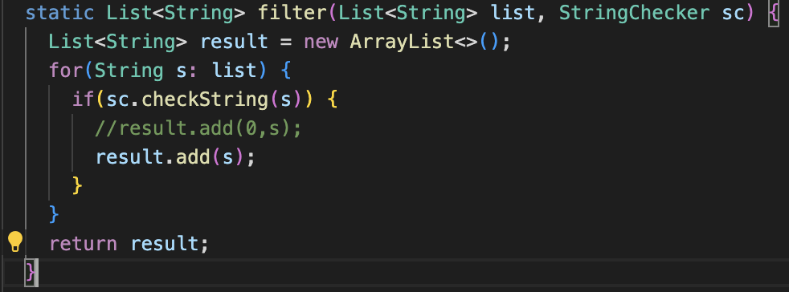

# Week 3 Lab Report

## Samanyu Parvathaneni

```
import java.net.URI;
import java.util.ArrayList;
import java.io.IOException;

class Handler implements URLHandler {
    // The one bit of state on the server: a number that will be manipulated by
    // various requests.
    // The one bit of state on the server: a number that will be manipulated by
    // various requests.k
    String[] list = new String[100];
    ArrayList<String> strings = new ArrayList<>();


    public String handleRequest(URI url) {
        if (url.getPath().equals("/")) {
            return String.format("Strings: " + strings.toString());
        } 
        else {
            System.out.println("Path: " + url.getPath());
            if (url.getPath().contains("/add")) {
                String[] parameters1 = url.getQuery().split("=");
                if (parameters1[0].equals("s")) {
                    strings.add(parameters1[1]);
                    return String.format("String added: " + "\"" + parameters1[1] + "\"");
                }
            }

            if (url.getPath().contains("/search")){
                String[] parameters2 = url.getQuery().split("=");
                ArrayList<String> query = new ArrayList<>();
                if (parameters2[0].equals("s")){
                    for (int j = 0; j < strings.size(); j++){
                        query.add(strings.get(j));
                    }
                    return String.format("Searched for strings: " + query.toString());
                }
            }
            return "404 not found";
        }
    }
}


class SearchEngine {
    public static void main(String[] args) throws IOException {
        if(args.length == 0){
            System.out.println("Missing port number! Try any number between 1024 to 49151");
            return;
        }

        int port = Integer.parseInt(args[0]);

        Server.start(port, new Handler());
    }
}
```


For the first image, I am calling the `.getQuery()` method, the `.split()` method, `.equals()` method, the `.add()` method, and the `.format()` method. The `.split()` method gets passed an "=", in order to split the URL. The `.equals()` method gets passed an "s" to it to validate if the URL follows the correct format. The `.add()` method passes the second value in the parameters array, which adds the second half of the URL path to the ArrayList. Finally, the `.format()` method is called on the `String` class to display what string had been added. The field variable `strings` changes in this image because `parameters[1]` gets added to it.


Since this image captures the adding of another string value, it will be the same as the previous image. I am calling the `.getQuery()` method, the `.split()` method, `.equals()` method, the `.add()` method, and the `.format()` method. The `.split()` method gets passed an "=", in order to split the URL. The `.equals()` method gets passed an "s" to it to validate if the URL follows the correct format. The `.add()` method passes the second value in the parameters array, which adds the value of the URL to the ArrayList. Finally, the `.format()` method is called on the `String` class to display what string had been added. The field variable `strings` changes in this image because `parameters[1]` gets added to it.


In this image, I am calling the `.getQuery()` method, the `.split()` method, the `.equals()` method, the `.add()` method, and the `.format()` method. The `.split()` method gets passed an "=", to split URL. The `.equals()` method gets passed an "s" to it to check if it has the correct format. The `.add()` method passes the second value in the parameters array, which adds the value of the second half of the URL path to the ArrayList. This time, however, it gets added to `query`, not `strings`. The `.format()` method is called on the `String` class to display what queries had been searched for. The field variable `query` changes in this image because `parameters[1]` gets added to it.


The failure-inducing input is an array of length greater than 1. In this example, the method is supposed to reverse the order of the values in the array. Due to the implementation, however, once you reach the second half of the array, it begins assigning values equal to itself because it is accessing values at indices that already been updated. To correct this, I access each element at the index of i and store it in a temporary variable. Then, I update the element at the index of i to be the element at the index of arr.length-i-1. Finally, I update the element at the index of arr.length-i-1 to be the temporary variable. I do this while i < arr.length/2 because I am updating two elements in the array per iteration of the for loop. 





In this example, the method is supposed to add values at the end of the List, but this implementation inserted new values at the beginning of the List, which is an incorrect behavior.
