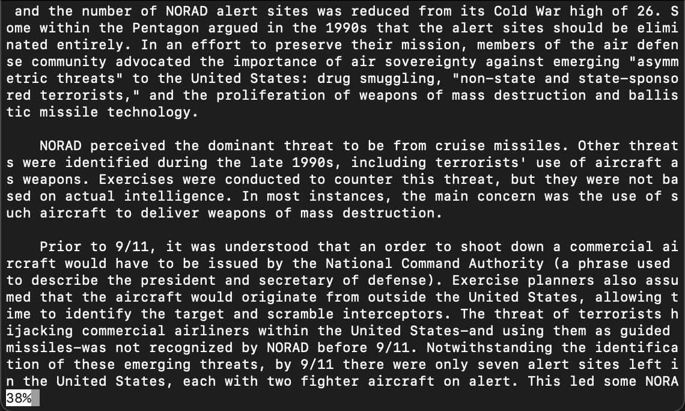
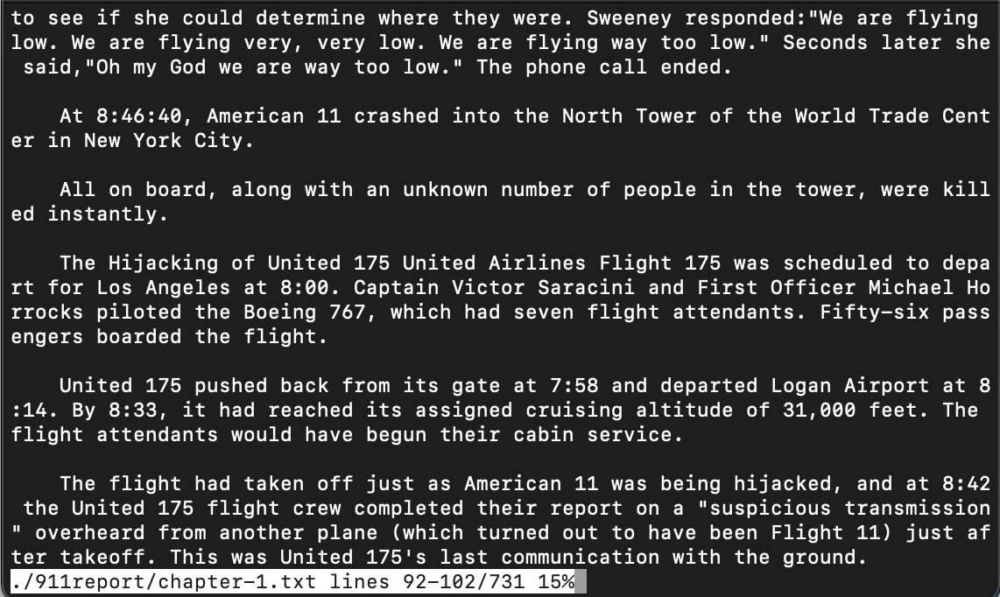
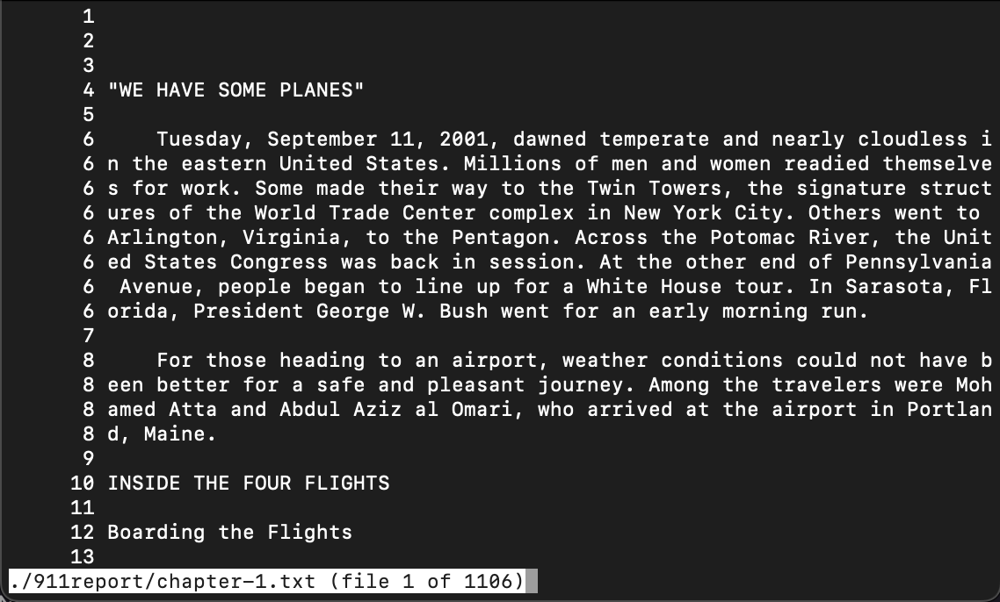
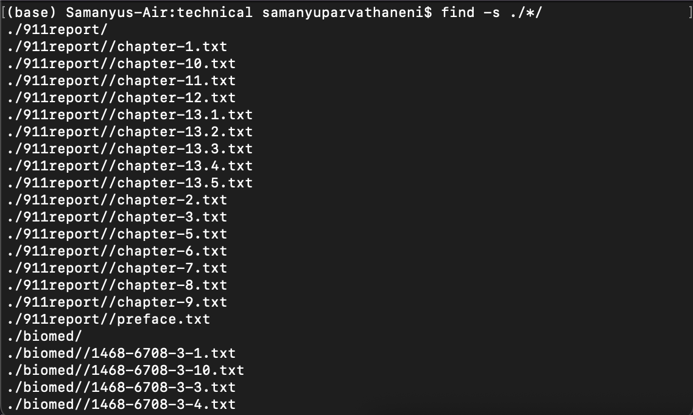
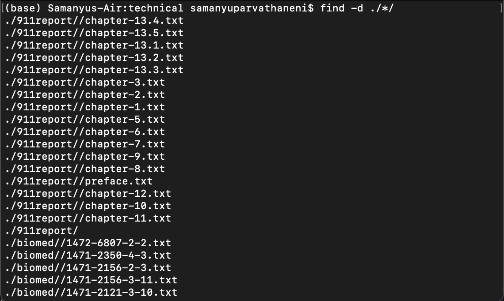
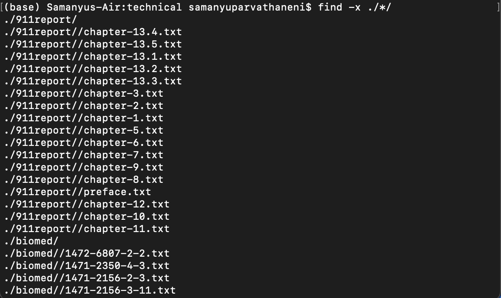
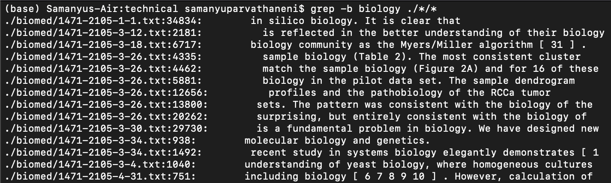
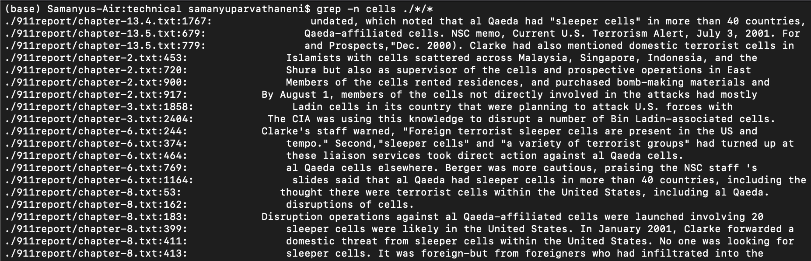

# Week 5 Lab Report

## Samanyu Parvathaneni

### ```less```

```
less -m ./*/*.txt
```


The `-m` option provides a progress tracker at the bottom that tells the user what percentage of the file they have read through.

```
less -M ./*/*.txt
```


The `-M` option provides an even more functional version of the previous command option. This one includes what lines are being displayed on the terminal screen out of how many lines there are, and this one includes the percentage read through.

```
less -N ./*/*.txt
```


The `-N` option adds the line number of each line to the beginning of each line.


### ```find```

```
find -s ./*/
```


The `-s` option lists the directories and file paths lexographically (alphabetical within each directory).

```
find -d ./*/
```


The `-d` option causes the output to be listed after a depth-first traversal has been made.

```
find -x ./*/
```


The `-x` option prevents find from calling the command on the returned directories that have a device number different than that of the file from which the descent began.


### ```grep```

```
grep -L terrorism ./*/*
```


The `-L` option outputs all of the file names that do not have the passed argument in its contents.

```
grep -b biology ./*/*
```


The `-b` option displays the offset in bytes of a matched pattern after file path.

```
grep -n cells ./*/*
```


