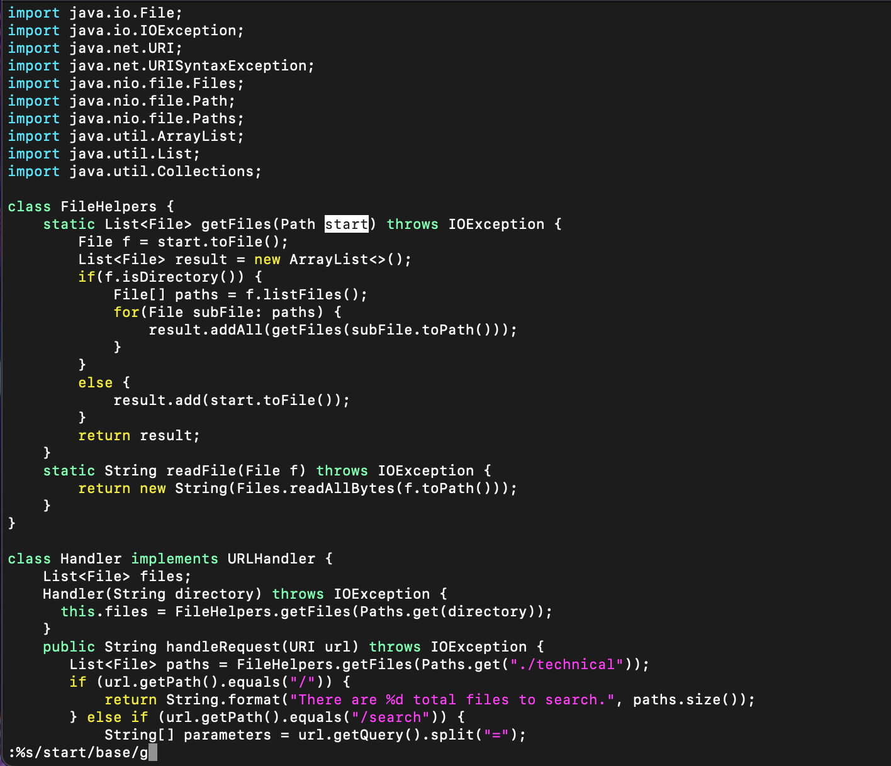

# Week 7 Lab Report

## Samanyu Parvathaneni

### Changing the name of the `start` parameter and its uses to `base`

After accessing the file with vim by entering `vim DocSearchServer.java`, I was met with this screen.

In order to replace all appearances of the string `start` with `base`, I entered the following vim command:

`:%s/start/base/g<Enter>`

This single command replaces all instances of the string `start` with `base`

