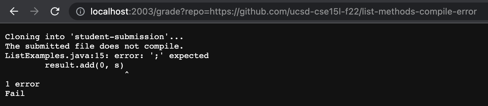
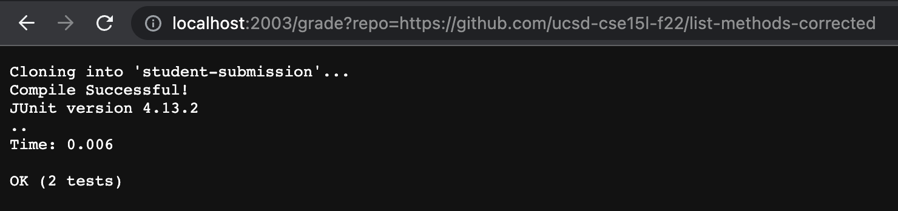
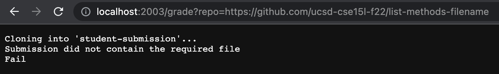

# Week 7 Lab Report

## Samanyu Parvathaneni

### Code Block

```
rm -rf student-submission
git clone $1 student-submission
if [[ -f ./student-submission/ListExamples.java ]]
then
    cp ./student-submission/ListExamples.java .
    javac -cp .:./lib/hamcrest-core-1.3.jar:./lib/junit-4.13.2.jar *.java 2> output-error.txt
    if [[ -s output-error.txt ]]
    then
        echo "The submitted file does not compile."
        cat output-error.txt
        echo "Fail"
        exit
    else
        echo "Compile Successful!"
        java -cp .:./lib/hamcrest-core-1.3.jar:./lib/junit-4.13.2.jar org.junit.runner.JUnitCore TestListExamples
    fi
else
    echo "Submission did not contain the required file"
    echo "Fail"
    exit
fi
```
### Screenshots







### Trace

Trace for https://github.com/ucsd-cse15l-f22/list-methods-filename:

The first line removes the `student-submission` folder from the current directory. Then, it clones the file passed in the terminal and places it in a newly created folder called `student-submission`. The following `if` statement evaluates to false because there does not exist a file called `ListExamples.java` in `student-submission`. The lines 6-16 do not run because they are in the `if` branch that does not evaluate.
